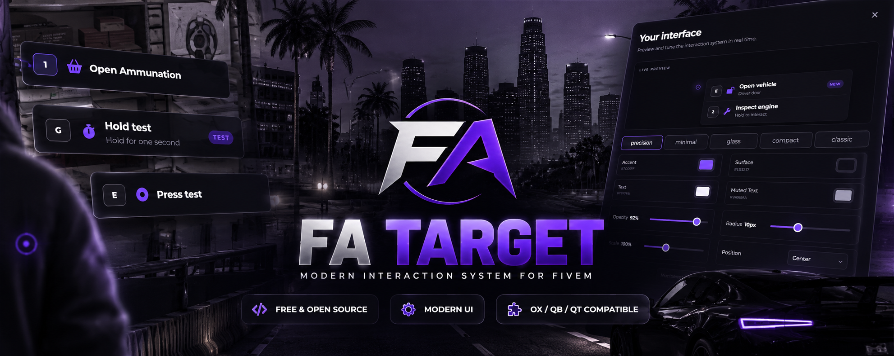
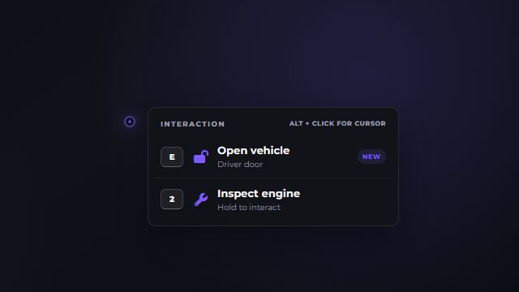
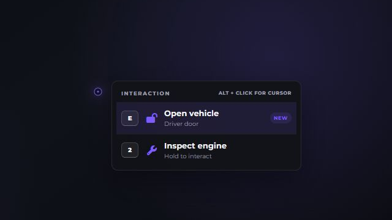
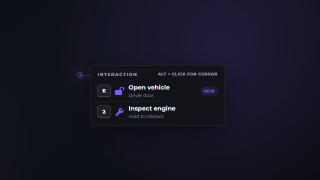
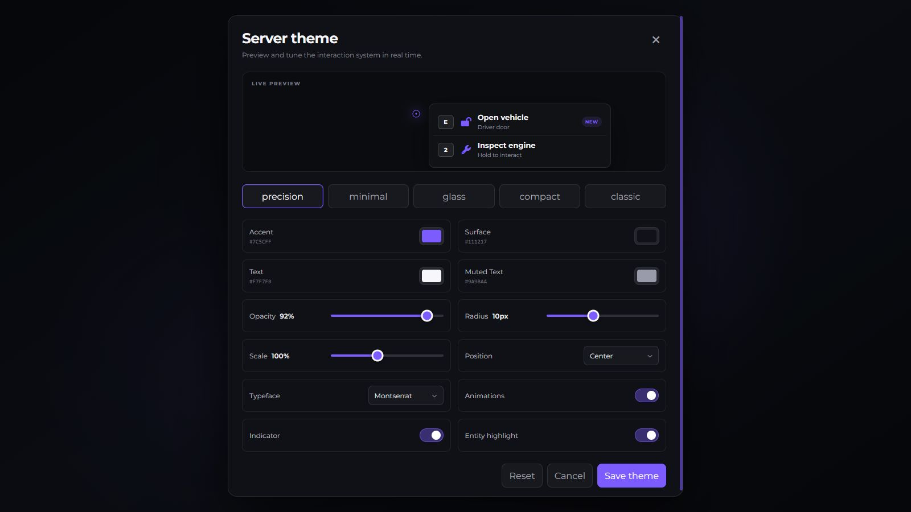

<p align="center">
  
</p>

<h1 align="center">FA Target</h1>

<p align="center">
  Modern interaction system for FiveM with Focus, Classic and DUI modes.
</p>

<p align="center">
  <a href="https://docs.fascripts.com/scripts/fa-target/overview">Documentation</a> •
  <a href="...">Download</a> •
  <a href="https://discord.gg/ePYv5V5b8w">Discord</a> •
  <a href="...">Showcase</a>
</p>

**FA Target is a modern, free and open-source interaction system for FiveM, built on the proven ``ox_target`` engine.**  
Maintain compatibility with existing resources while adding modern interaction modes, world-anchored UI, per-option keybinds, hold interactions, action feedback, and a fully customizable Theme Creator.  
Designed as a drop-in replacement for ``ox_target``, with compatibility adapters for ``qb-target`` and ``qtarget``.  

## Features
- **3 interaction modes** - Focus, Classic and world-anchored DUI
- **Theme Creator** - customize the interaction UI directly in-game
- **Option keybinds** - trigger interactions using configurable keys
- **Hold interactions** - require an option to be held for a configured duration
- **Descriptions & badges** - provide additional context without cluttering labels
- **Action feedback** - pending, success and error states for asynchronous interactions
- **World-anchored UI** - DUI mode follows the target position in the world
- **Drop-in ox_target compatibility** - existing `exports.ox_target:*` calls continue to work
- **qb-target & qtarget adapters** - supports common legacy registration formats
- **Controller support**
- **Zones, entities, models, bones and global targets**
- **Runtime theme updates** - server themes update connected players without a restart
- **ACE-controlled theme administration**

## Preview

<p align="center">
  
  
  
</p>

<p align="center">
  <sub>Focus • Classic • DUI</sub>
</p>

## Compatibility

| Feature | ox_target | qb-target | qtarget |
| --- | :---: | :---: | :---: |
| Zones | ✅ | ✅ | ✅ |
| Entities | ✅ | ✅ | ✅ |
| Models | ✅ | ✅ | ✅ |
| Bones | ✅ | ✅ | ✅ |
| Global options | ✅ | ✅ | ✅ |
| Jobs | ✅ | ✅ | ✅ |
| Gangs | — | ✅ | ✅ |
| Items | ✅ | ✅ | ✅ |
| Client events | ✅ | ✅ | ✅ |
| Server events | ✅ | ✅ | ✅ |
| Callbacks / actions | ✅ | ✅ | ✅ |

Existing resources using `exports.ox_target:*` do not need to be rewritten.

## Requirements

- `ox_lib` >= 3.30.0
- OneSync recommended

## Installation

1. Download the latest release.
2. Extract it into your `resources` directory as `fa_target`.
3. Add the resource to your `server.cfg` after `ox_lib`:

```cfg
ensure ox_lib
ensure fa_target
```
4. Remove your previous target resource.
5. Restart the server.

> [!IMPORTANT]
> **Do not** run FA Target alongside another resource providing `ox_target`, `qb-target`, or `qtarget`.

<p align="center">
  
</p>

## Theme Creator

FA Target includes an in-game Theme Creator for customizing the interaction UI without manually editing CSS.

### Player preferences

Use `/fatheme` to open personal appearance settings when enabled by the server.

### Server theme editor

Administrators with the following ACE permission can use `/fathemeadmin`:

```cfg
add_ace group.admin fa_target.theme allow
```

Server themes:

- Persist between restarts using resource KVP
- Update connected players live
- Define which fields players may override locally

## Configuration

`config.lua` controls framework and inventory detection, interaction modes, keybinds, blocking states, visual indicators, and player theme permissions.

Explicit bridge values take precedence over auto-detection.

DUI mode uses the regular NUI renderer anchored to the raycast world coordinate, avoiding a separate browser instance for every target.

### Local fonts

Montserrat Variable is bundled locally and is the default for runtime interactions and the Theme Creator. To add a custom font, copy its `.woff2` file to `web/public/fonts`, add one entry to `Config.Theme.fonts`, and rebuild the UI:

```lua
{
    id = 'customer_font', label = 'Customer Font', family = 'Customer Font',
    file = 'CustomerFont.woff2', weight = '100 900'
}
```

Only local `.woff2` filenames are accepted.

## API

### ox_target compatibility

`fa_target` registers `ox_target`'s exports. Together with `provide 'ox_target'`, this keeps `exports.ox_target:*` calls.

```lua
exports.ox_target:addBoxZone({
    coords = vec3(441.2, -981.9, 30.7), size = vec3(2, 2, 2),
    options = {{ name = 'armoury', label = 'Open armoury', event = 'police:armoury' }}
})
```

### FA Target extensions
FA extensions are accepted on every option:

```lua
exports.fa_target:addLocalEntity(ped, {{
    name = 'dealer_talk', label = 'Talk to dealer',
    description = 'Browse available vehicles', icon = 'fa-solid fa-car',
    badge = 'NEW', key = 'E', hold = 1200, mode = 'focus',
    onSelect = function(data)
        return { status = 'success', message = 'Opening catalogue' }
    end
}})
```

| Property | Type | Description |
| --- | --- | --- |
| `description` | `string` | Secondary text displayed below the option label |
| `badge` | `string` | Small badge displayed alongside the option |
| `key` | `string` | Key used to trigger the option |
| `hold` | `number` | Required hold duration in milliseconds |
| `mode` | `string` | Overrides the interaction mode for the option |

### Async actions

For asynchronous interactions, return `pending` and resolve the action later with `exports.fa_target:resolveAction(requestId, result)`.

### Handler priority

FA Target preserves the following handler priority:

1. `onSelect`
2. `export`
3. client `event`
4. `serverEvent`
5. `command`

## Security

Visibility and `canInteract` are client-side UX checks, not authorization. Server events must independently validate the player, entity, distance, permissions, inventory and all state-changing input. Never trust prices, rewards, item counts or entity ownership received from NUI/client code.

## Development / Building from source
If you cloned the repository instead of downloading a release build, build the NUI before starting the resource:

```bash
cd web
npm install
npm run build
```
The production build is generated in ``web/dist``.

> [!NOTE]
> Release archives already include the compiled ``web/dist`` files.

## Credits

FA Target is based on the MIT-licensed `ox_target` project.

See [UPSTREAM.md](UPSTREAM.md) for upstream attribution and information about modifications made by FA Scripts.

## License

FA Target is released under the [MIT License](LICENSE).
